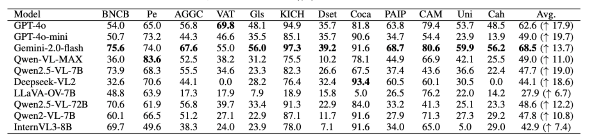

# Retrieval-Augmented Large Multimodal Models for Pathology
## Abstract
With the rapid advancement of multimodal foundation models, artificial intelligence (AI) has shown increasing promise in computational pathology. Nevertheless, existing approaches remain highly dependent on large-scale annotated datasets, whereas real-world pathological data are often limited in quantity and exhibit poor generalization across cohorts. To overcome these challenges, we systematically evaluate state-of-the-art large multimodal models (LMMs) on pathology-related tasks under both zero-shot and few-shot settings. Furthermore, we propose a retrieval-augmented framework that integrates semantically relevant examples to enhance contextual reasoning and diagnostic understanding in LMMs. By leveraging retrieved image–text examples as external evidence, the framework enables the model to capture fine-grained pathological patterns and generate more consistent and interpretable predictions. Extensive experiments across multiple pathology datasets demonstrate that this strategy yields significant performance improvements, highlighting the effectiveness of retrieval-based contextual augmentation in enhancing both reasoning capability and generalization in complex medical domains. 


## 🛠️ 1.Environment Setup
###  To Run LLaVA-OV
  ```
  conda create -n LLaVA-OV python=3.10.15
  conda activate LLaVA-OV
  pip install -r requirements
  ```
### To Run LLaVA
  refer to https://github.com/haotian-liu/LLaVA
  ```
  cd src/
  git clone https://github.com/haotian-liu/LLaVA.git
  cd LLaVA

  conda create -n llava python=3.10 -y
  conda activate llava
  pip install --upgrade pip  # enable PEP 660 support
  pip install -e .

  pip install tabulate
  ```
### To Run Qwen
  refer to https://github.com/QwenLM/Qwen2.5-VL
  ```
  conda create -n Qwen python=3.10.15
  conda activate Qwen
  pip install transformers==4.51.3 accelerate 

  #It's highly recommended to use `[decord]` feature for faster video loading.

  pip install qwen-vl-utils[decord]
  ```
## 📂 2.Dataset
| Dataset Name      |  Source Link |
|-------------------|--------------------------------------------------------------|
| CocaHis    | https://portal.gdc.cancer.gov/                                      |
| PAIP19     | https://paip2019.grand-challenge.org/                               |
| BNCB       | https://bcnb.grand-challenge.org/                                   |
| AGGC\_2022 | https://aggc22.grand-challenge.org/                                 |
| CAMEL      | https://drive.google.com/open?id=1brr8CnU6ddzAYT157wkdXjbSzoiIDF9y  |
| Gleason    | https://github.com/eiriniar/gleason_CNN                             |
| VALSET     | https://zenodo.org/records/7548828                                  |
| KICH       | http://39.171.241.18:8888/RCdpia/annotation.php                     |
| CATCH      | https://www.cancerimagingarchive.net/collection/catch/              |

## 📦 3.Model

### 🔓 Open Models Checkpoints

| Model Name        | Checkpoints Link |
|-------------------|-------------------------------------------------------------|
| Qwen2.5-VL-7B     | https://huggingface.co/Qwen/Qwen2.5-VL-7B-Instruct          |
| Qwen2.5-VL-72B    | https://huggingface.co/Qwen/Qwen2.5-VL-72B-Instruct         |
| Qwen2-VL-7B       | https://huggingface.co/Qwen/Qwen2-VL-7B-Instruct            |
| Deepseek-VL2      | https://huggingface.co/deepseek-ai/deepseek-vl2             |
| LLaVA-OV-7B       | https://huggingface.co/lmms-lab/llava-onevision-qwen2-7b-ov |
| InternVL3-8B      | https://huggingface.co/OpenGVLab/InternVL3-8B-Instruct      |
| LLaVA-1.5-13B     | https://huggingface.co/liuhaotian/llava-v1.5-13b            |
| PathGen-LLaVA     | https://huggingface.co/jamessyx/PathGen-LLaVA               |
| LLaVA-Med-7B      | https://huggingface.co/microsoft/llava-med-v1.5-mistral-7b  |
| MedGemma4B        | https://huggingface.co/google/medgemma-4b-it                |

### 🔒 Closed Models Link

| Model Name         |  API  Link |
|--------------------|------------------------------------------------|
| GPT-4o             | https://platform.openai.com/                   |
| GPT-4o-mini        | https://platform.openai.com/                   |
| Qwen-VL-MAX        | https://help.aliyun.com/zh/model-studio/models |
| Gemini-2.0-flash   | https://deepmind.google/technologies/gemini/   |

## 🧩 4.Method

An illustrative overview of the two main processes in PathMQA Q\&A generation: data collection and dataset construction, with the dataset construction showcasing the workflows for retrieval-based multi-image processing.
## 📌 5.Usage
### 📊 process data
#### step1: Obtain the JSON file from the dataset, which contains image identifiers and corresponding captions. This file serves as a critical source of metadata required for the following steps.

  __Data example__:
  ```
    [
    {
      "image": "Amended_Training_2__01_01_0106__672__1324__Viable-tumor.jpg",
      "caption": "Viable-tumor",
      "source": "liver"
    }
    ]
  ``` 
####  step2: Run the following command to generate zero-shot and few-shot data.
  - zero-shot
    ```
    python RALM-Path/datapreprocess/main.py 
        --n_shot 0 \
        --root_directory /data/pathology \
        --model_path ./model/ \
        --output_val_file ./zero-shot.json \
   
    ```
  - few-shot
    ```
    python RALM-Path/datapreprocess/main.py 
        --n_shot 1 \
        --root_directory /data/pathology \
        --model_path ./model/  \
        --blacklist_file ./zero-shot.json \
        --output_val_file ./1-shot.json \ 
    ```
    where n_shot denotes the number of samples per class in the few-shot setting.
### 🧪 Run Evaluation
  - open-model 
  ```
  bash   RALM-Path/model_eval/muti-eval.sh
  python RALM-Path/model_eval/postpreprocess.py
  python RALM-Path/model_eval/eval.py

  ```
  - close-model eval
  ```
  python RALM-Path/model_eval/close_model.py
  python RALM-Path/model_eval/postpreprocess.py
  python RALM-Path/model_eval/eval.py
  ```
  - Platform
  GPU: 8 * NVIDIA A100-40G GPUs and Hygon C86 7285 32-core CPU
## 📈 6. Main results
